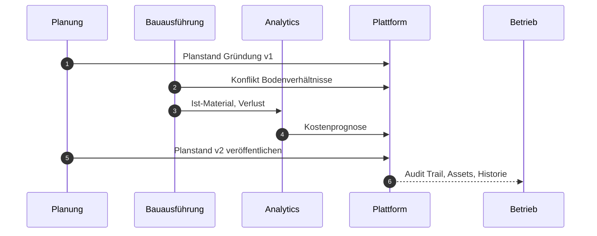

---
layout: cover
class: text-center
---

  <WbkLogo img-class="w-80" />
  
Hackathon 2026

  <h1 class="text-3xl font-medium !mt-0">Planung → Bau → Betrieb</h1>
  

    Eine gemeinsame Projektwahrheit über alle Phasen eines realen Bauprojekts.
  

---
layout: center
class: bg-geist-grid
---

  
Kernbotschaft

  <h2 class="text-3xl font-medium leading-tight">
    WBK 2026 zeigt nicht nur getrennte Dashboards, sondern den
    durchgängigen Lebenszyklus
    eines realen Bauprojekts.
  </h2>
  

    Planer liefern Planstände, Bau-Teams melden Konflikte zurück, Betreiber übernehmen die vollständige Historie für Wartung, Assets und Entscheidungen.
  

---
layout: two-cols
---

  
Problem

  <h2 class="text-2xl font-medium">Getrennte Werkzeuge, verlorene Kontexte</h2>
  <ul class="wbk-list mt-6 text-base">
    <li>Planung, Bauausführung und Betrieb arbeiten in isolierten Systemen</li>
    <li>Konflikte aus der Realität erreichen die Planung zu spät</li>
    <li>Materialschwund und Nachkauf bleiben unsichtbar</li>
    <li>Betreiber übernehmen ein Bauwerk ohne Entscheidungshistorie</li>
  </ul>

::right::

  
Heute typisch

  

    

      Planung
      ↔
      kein Rückkanal
    

    

      Bau
      ↔
      Excel &amp; WhatsApp
    

    

      Betrieb
      ↔
      fehlende Historie
    

  

  

    WBK verbindet alle drei Domänen in einem gemeinsamen Projektkontext.
  

---
layout: default
class: bg-geist-grid
---

Zielgruppen

<h2 class="text-2xl font-medium mb-2">Eine Plattform, drei Domänen</h2>

  

    
Planung

    
Architektur, Tragwerk, TGA

    

      Planstände veröffentlichen, Konflikte beantworten, Kostenwirkung sehen.
    

  

  

    
Bau

    
Bauleitung, Teams, Einkauf

    

      Fortschritt melden, Konflikte dokumentieren, Material und Lager steuern.
    

  

  

    
Betrieb

    
FM, Wartung, Betreiber

    

      Historie, Assets und Wartungsfolgen aus dem Bau übernehmen.
    

  

---
layout: default
---

Nutzenversprechen

<h2 class="text-2xl font-medium mb-6">Was WBK 2026 liefert</h2>

<ul class="wbk-list text-base grid grid-cols-2 gap-x-8">
  <li>Eine gemeinsame Projektwahrheit über alle Phasen</li>
  <li>Konflikte, Kosten- und Zeitwirkung jederzeit nachvollziehbar</li>
  <li>Material- und Kostenwahrheit: geplant, verbaut, Schwund, Prognose</li>
  <li>Reale Baustellenlage per Kamera-Scan, bestätigt ins System</li>
  <li>Audit Trail für Entscheidungen und Verantwortlichkeiten</li>
  <li>ERP/EAP-Daten mit klarer Herkunftskennung</li>
</ul>

---
layout: default
class: bg-geist-grid
---

Demo-Szenario

<h2 class="text-2xl font-medium mb-4">Beispielkonflikt: Gründungsplanung</h2>

  
Planer veröffentlicht die initiale Gründungsplanung

  
Bau-Team stellt abweichende Bodenverhältnisse fest und meldet Konflikt

  
Kommentar, Risikobewertung und Kostenprognose entstehen

  
Planung passt Planstand an und veröffentlicht neue Version

  
Kosten- und Zeitplanwirkung werden im Cockpit sichtbar

  
Betreiber übernimmt Historie, Assets und Wartungsfolgen

---
layout: iframe
url: https://wbk.2026.hackathon.kevinbeier.com/worker/overview
scale: 0.9
---

<LiveAppLink href="https://wbk.2026.hackathon.kevinbeier.com/worker/overview" label="Live-App in neuem Tab öffnen" />

---
layout: two-cols
---

  
Live-Demo

  <h2 class="text-2xl font-medium">Worker Overview</h2>
  

    Die Worker-Ansicht vereint Lagerbestand und Kamera-Scan in einem Arbeitsbereich — optimiert für Baustellen- und Lager-Teams.
  

  <ul class="wbk-list mt-6 text-sm">
    <li>Resizable Split-Layout für Bestand und Kamera</li>
    <li>Touch-freundliche Bestandsbuchung</li>
    <li>Vision-Scan mit Bestätigung vor System-Update</li>
    <li>Signal-Farben für Planabweichungen</li>
  </ul>

::right::

  

    
Links

    
Lagerbestand

    
Artikel, Mengen, Schnellbuchung

  

  

    
Rechts

    
Kamera-Panel

    
Scan, Erkennung, Bestätigung

  

  

    auf Plan
    Abweichung
  

---
layout: default
---

Technische Säulen

<h2 class="text-2xl font-medium mb-6">Architektur &amp; Stack</h2>

  

    
Next.js + shadcn/ui

    
Ruhiges, dichtes Dashboard mit Geist Sans/Mono

  

  

    
Repository-Schicht

    
Mock zuerst, Supabase-Adapter identisch

  

  

    
Analytics-Engines

    
Schwundquote, Kostenprognose, Baseline

  

  

    
Vision

    
Kamera-Scan mit Bestätigung, Demo-Modus

  

  

    
ERP/EAP-Adapter

    
Externe Material- und Betriebsdaten mit Herkunftskennung

  

---
layout: center
class: text-sm
---

Ablauf

<h2 class="text-xl font-medium mb-6">Planung → Bau → Betrieb</h2>

---
layout: end
class: text-center
---

  <WbkMark img-class="w-20" />
  <h2 class="text-2xl font-medium !mt-0">WBK 2026</h2>
  

    <a href="/slides/" target="_blank">
      Präsentation: /slides
    </a>
    <a href="https://wbk.2026.hackathon.kevinbeier.com/worker/overview" target="_blank">
      Live-App: Worker Overview
    </a>
    <a href="https://github.com/Beierthon/wbk2026" target="_blank">
      GitHub: Beierthon/wbk2026
    </a>
  

  

    Fragen? Diskussion gerne nach der Demo.
  

