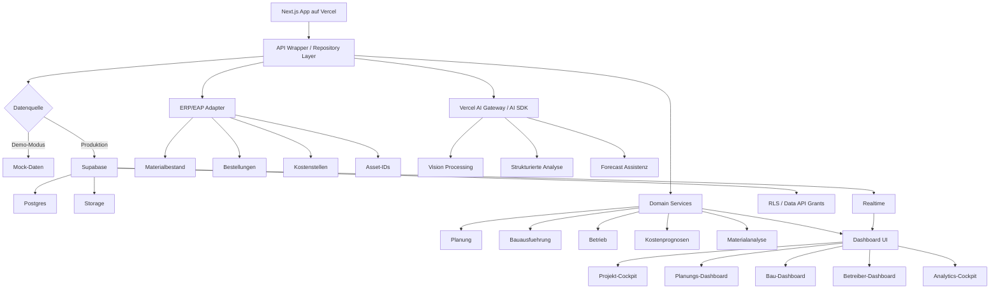
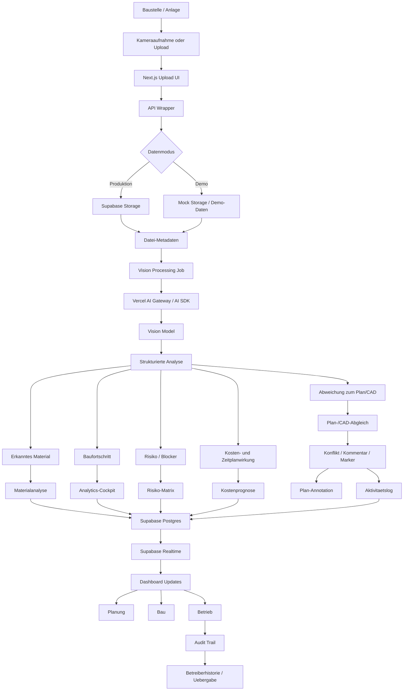
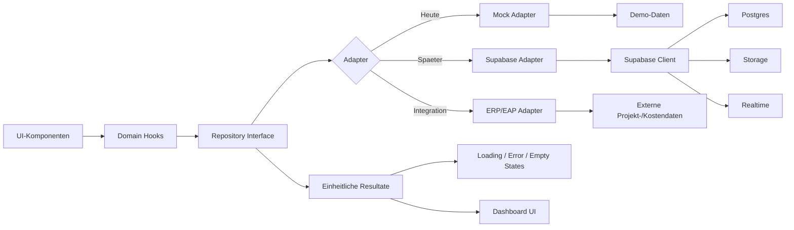
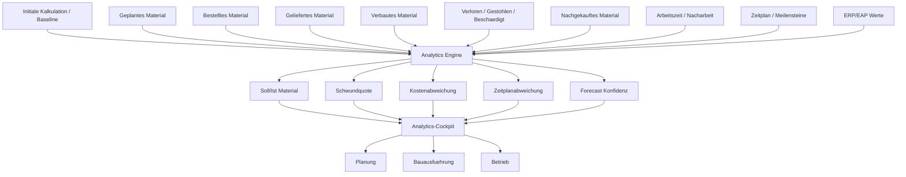
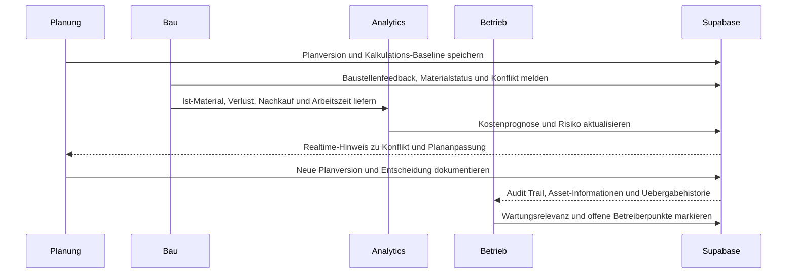

# Architecture & Mermaid Flows

Diese Datei sammelt die wichtigsten Architektur- und Produktfluesse fuer WBK 2026. Die Diagramme sind bewusst GitHub-kompatibel gehalten, damit sie direkt in Issues, PRs und spaeteren Docs wiederverwendet werden koennen.

## Gesamtarchitektur

## Vision Processing: Kamera, Plan und CAD

## API Wrapper: Mock-Daten zuerst, Supabase spaeter

## Analytics: Material, Kalkulation und Zeitplan

## Domain Workflow: Planung -> Bau -> Betrieb

## Offene Diagramm-Backlog-Ideen

- Supabase RLS/Data-API-Grenzen je Tabelle.
- Storage-Bucket-Flow fuer Planunterlagen, Fotos und Uebergabedokumente.
- ERP/EAP-Synchronisation mit Konfliktstatus.
- Vercel Preview Deployment Flow.
- Kostenprognose-Engine mit Annahmen, Versionierung und Audit Trail.
