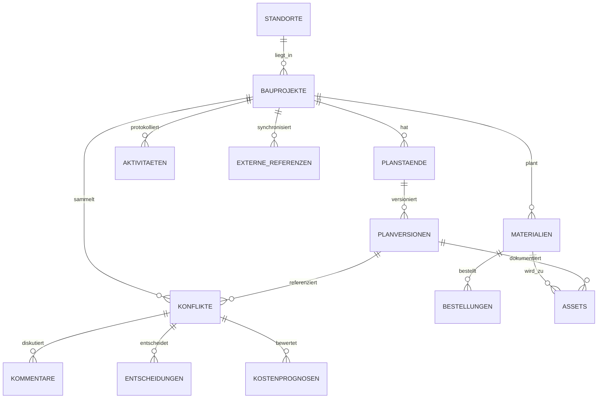

# Fachliches Datenmodell

Dieses Datenmodell ist die gemeinsame Sprache fuer Planung, Bau und Betrieb. Es ist bewusst fachlich auf Deutsch beschrieben und parallel als TypeScript-Vertrag in `@workspace/domain` gepflegt, damit Mock-Daten, API Wrapper, Supabase-Migrationen und Dashboards dieselben Objektgrenzen verwenden.

## Ziele

- Planung, Bauausfuehrung und Betrieb arbeiten auf denselben Projektobjekten.
- Jede relevante Aenderung kann spaeter als Aktivitaet oder Audit-Trail-Eintrag nachvollzogen werden.
- Supabase-Tabellen koennen aus den Entitaeten und Pflichtfeldern abgeleitet werden.
- Rechte- und Rollenmanagement bleibt fuer den Hackathon ausserhalb des Scopes, wird aber als spaeterer RLS-Ausbau beruecksichtigt.

## Entitaeten

| Entitaet | Pflichtfelder | Zweck |
| --- | --- | --- |
| Standort | `id`, `name`, `adresse`, `baugrundHinweise`, `umfeldHinweise` | Kontext fuer Baugrund, Umfeld und spaetere Konflikte. |
| Bauprojekt | `id`, `name`, `phase`, `status`, `standortId`, `projektleitung`, Termine, `budgetCent` | Gemeinsame Klammer fuer Planung, Bau, Betrieb und Analytics. |
| Planstand | `id`, `projektId`, `titel`, `fachbereich`, `aktuelleVersionId` | Buendelt fachliche Plaene wie Architektur, TGA oder Betrieb. |
| Planversion | `id`, `planstandId`, `version`, `status`, `veroeffentlichtVon`, `aenderungsnotiz` | Versionierte Planbasis fuer Kommentare, Konflikte und Entscheidungen. |
| Konflikt | `id`, `projektId`, `titel`, `beschreibung`, `quelle`, `zielDomaene`, `status`, `prioritaet`, `verantwortlich` | Abweichung oder Rueckfrage zwischen Baustelle, Planung und Betrieb. |
| Kommentar | `id`, `projektId`, `autor`, `rolle`, `text` | Nachvollziehbare Kommunikation an Konflikt oder Planversion. |
| Entscheidung | `id`, `projektId`, `konfliktId`, `titel`, `begruendung`, `status`, `folgenFuerBetrieb` | Dokumentiert, warum ein Konflikt wie geloest wurde. |
| Material | `id`, `projektId`, `name`, `einheit`, Mengenfelder, `status`, `kostenProEinheitCent` | Grundlage fuer Bau-Dashboard, Materialanalyse und Kostenprognose. |
| Bestellung | `id`, `projektId`, `materialId`, `menge`, `status` | Verbindet Materialbedarf mit Lieferung und ERP/EAP-Referenzen. |
| Asset | `id`, `projektId`, `name`, `standortBeschreibung`, `status`, `herkunft`, `offenePunkte` | Uebergibt verbaute Bauteile in den Betreiberkontext. |
| Aktivitaet | `id`, `projektId`, `art`, `quelle`, `titel`, `beschreibung`, `bezug` | Timeline fuer Plan, Konflikt, Material, Asset und Entscheidung. |
| Externe Referenz | `id`, `projektId`, `system`, `systemName`, `externerSchluessel`, `objektTyp` | Verweist auf ERP/EAP, Kostenstelle, Bestellung oder Asset-ID. |
| Kostenprognose | `id`, `projektId`, Kostenfelder, `gesamtMehrkostenCent`, `zeitwirkungTage`, `konfidenz`, `annahmen` | Bewertet Material, Arbeit, Bauzeit und Betriebsauswirkungen eines Konflikts. |

Alle Entitaeten tragen `createdAt` und `updatedAt`. Primaerschluessel sind Strings, damit Mock-Daten, Supabase UUIDs und externe IDs im Demo-Modus einheitlich behandelt werden koennen.

## Beziehungen

## Dashboard-Abdeckung

- Planung (#3): nutzt `Planstand`, `Planversion`, `Konflikt`, `Kommentar` und `Entscheidung`.
- Bau (#4): nutzt `Material`, `Bestellung`, `Konflikt`, `Kommentar`, `Aktivitaet` und `ExterneReferenz`.
- Supabase (#5): kann Tabellen aus `DOMAIN_TABLES` und den TypeScript-Interfaces ableiten.
- Betrieb (#6): nutzt `Asset`, `Entscheidung`, `Aktivitaet`, `Planversion` und `Material`.
- Kostenprognosen (#12): nutzt `Kostenprognose`, `Konflikt`, `Material` und `Aktivitaet`.

## Supabase-Ableitung

Die empfohlenen Tabellennamen sind in `DOMAIN_TABLES` definiert:

| TypeScript-Key | Supabase-Tabelle |
| --- | --- |
| `standorte` | `standorte` |
| `projekte` | `bauprojekte` |
| `planstaende` | `planstaende` |
| `planversionen` | `planversionen` |
| `konflikte` | `konflikte` |
| `kommentare` | `kommentare` |
| `entscheidungen` | `entscheidungen` |
| `materialien` | `materialien` |
| `bestellungen` | `bestellungen` |
| `assets` | `assets` |
| `aktivitaeten` | `aktivitaeten` |
| `externeReferenzen` | `externe_referenzen` |
| `kostenprognosen` | `kostenprognosen` |

Fuer spaetere Migrationen gilt: Tabellen im exponierten Schema bekommen RLS, Data-API-Grants werden explizit geplant, und Rollen-/Rechteverwaltung wird nach dem Hackathon als eigener Ausbau behandelt.
