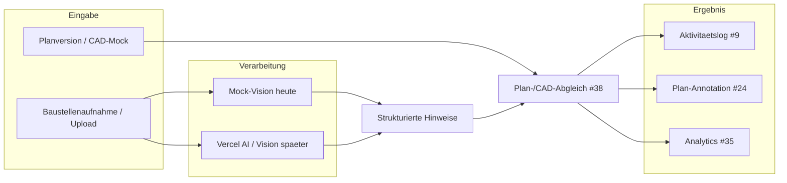
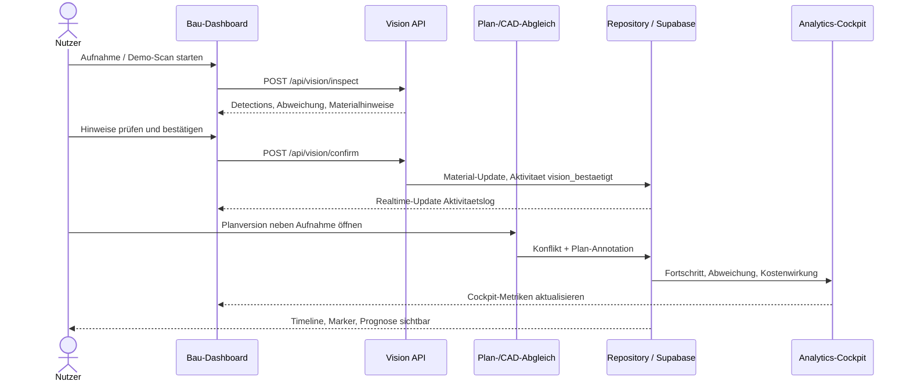

# Demo-Showcase: Baustellenkamera und Plan-/CAD-Abgleich

Dieser Guide beschreibt das Showcase-Szenario, in dem Baustellenaufnahmen mit Planständen abgeglichen und in konkrete Projektaktionen überführt werden. Er verbindet die Baustellenkamera ([#37](https://github.com/Beierthon/wbk2026/issues/37)), den Plan-/CAD-Abgleich ([#38](https://github.com/Beierthon/wbk2026/issues/38)) und die Zielarchitektur aus [architecture.md](../architecture.md) (#42).

## Storyline (Demo-Ablauf)

1. Nutzer lädt eine Baustellenaufnahme hoch oder startet den Demo-Scan (Mock-Kamera).
2. Die Aufnahme wird Projekt, Standort, Planversion und Zeitpunkt zugeordnet.
3. Vision Processing liefert strukturierte Hinweise zu Material, Fortschritt und Abweichung.
4. Nutzer bestätigt oder korrigiert die Hinweise vor dem System-Update.
5. Der Plan-/CAD-Abgleich erzeugt Konflikt, Marker, Risiko und mögliche Kostenwirkung.

Das Szenario nutzt das Demo-Projekt **Campus West** aus [demo-data.md](../demo-data.md): feuchte Auffüllschicht im Südfeld, Abweichung zu Plan `TWP-GRU-1.0`, Planungsantwort `TWP-GRU-1.1`.

## Architekturüberblick

Der End-to-End-Fluss ist im Architekturdiagramm **Vision Processing: Kamera, Plan und CAD** dokumentiert:

- [Vision Processing Flowchart](../architecture.md#vision-processing-kamera-plan-und-cad)

## Mock-Vision vs. Vercel AI / Vision (Produktion)

| Aspekt | Heute (Demo / Hackathon) | Später (Produktion) |
| --- | --- | --- |
| Backend | `WBK_VISION_MODE=mock`, Detector `mock-vision-backend` | `WBK_VISION_MODE=live` über Vercel AI Gateway / AI SDK |
| Modell | Stabile Beispieldaten, keine Credentials | Vision-Modell (strukturierte Analyse) |
| Speicher | Mock-Storage / In-Memory | Supabase Storage Bucket `baustellenfotos` ([#29](../supabase.md#storage-issue-29-planned)) |
| API | `POST /api/vision/inspect`, `POST /api/vision/confirm` | Gleicher Vertrag, anderer Detector |
| UI | Mock-Badge, Bestätigungsdialog | Unverändert — Datentransfer bleibt stabil |

Details zum technischen Vertrag und lokalen Schnelltest: [vision-demo.md](../vision-demo.md) und [vision.md](./vision.md).

**Wichtig:** Der Mock liefert vorhersagbare Bounding Boxes und Materialtreffer für Jury-Demos. Die spätere Live-Pipeline ersetzt nur die Analyse-Schicht; Aktivitätslog, Plan-Annotation und Analytics bleiben angebunden.

## Baustellenkamera (#37)

### Funktionen im Showcase

- **Upload oder Mock-Aufnahme** — Kamera-Stream, Demo-Scan ohne Kamera oder Bild-Upload im Bau-Dashboard.
- **Projektkontext** — Zuordnung zu Projekt, Standort, Planversion, Bauabschnitt und Zeitpunkt.
- **Manuelle Ergänzung** — Sichtbares Material, Fortschritt oder Konflikt können manuell markiert werden, auch wenn die KI noch nicht aktiv ist.
- **Bestätigung vor Schreiben** — Erst „Update bestätigen“ schreibt Mengen und Metadaten ins System (siehe [vision.md](./vision.md)).

### Ablauf (Baustellenkamera)

1. Im Bau-Dashboard **Kamera-Update starten**, **Demo-Scan ohne Kamera** oder **Bild hochladen** wählen.
2. Frame wird an `/api/vision/inspect` gesendet (~1 FPS im Live-Modus).
3. Erkannte Objekte erscheinen mit Labels, Confidence und ERP/EAP-Abgleich.
4. Nutzer prüft und bestätigt — oder bricht ab, ohne Zustand zu ändern.
5. Bestätigung erzeugt Aktivitätseintrag und optional Storage-Referenz (Produktion).

## Plan-/CAD-Abgleich (#38)

### Scope für Hackathon

- Kein vollständiges CAD/BIM-System — Plan-/CAD-Datei als Bild, PDF oder SVG-Mock.
- **Side-by-Side** — Baustellenaufnahme neben Planstand anzeigen.
- **Abgleichsmarker** — passt, Abweichung, unklar (manuell oder aus Vision-Hinweis).
- **Konsequenz** — Abweichung erzeugt Konflikt, Kommentar, Kosten-/Zeitplanwirkung und Betreiberhistorie.

### Ablauf (Plan-/CAD-Abgleich)

1. Planversion `TWP-GRU-1.0` als Referenz laden (Demo-Seed).
2. Baustellenaufnahme aus Kamera-Workflow (#37) oder Upload zuordnen.
3. Vision-Hinweis **Abweichung zum Plan/CAD** prüfen oder manuell markieren.
4. Konflikt anlegen — z. B. feuchte Auffüllschicht nicht im Plan.
5. Plan-Annotation (#24) setzen: Marker, Kommentar, Bezug zur Aufnahme.
6. Analytics (#35) und Kostenprognose (#22) aktualisieren; Risiko-Matrix (#23) bei Bedarf.

## Sequenzdiagramm (Showcase)

## Ergebnisfluss: Aktivität, Annotation, Analytics

| Ziel | Issue | Was landet dort |
| --- | --- | --- |
| Aktivitätslog | [#9](https://github.com/Beierthon/wbk2026/issues/9) | `vision_bestaetigt`, Konfliktmeldung, Planungsentscheidung — siehe [data-model.md](../data-model.md) |
| Plan-Annotation | [#24](https://github.com/Beierthon/wbk2026/issues/24) | Marker und Kommentar auf Planversion, Verknüpfung zur Baustellenaufnahme |
| Analytics-Cockpit | [#35](https://github.com/Beierthon/wbk2026/issues/35) | Baufortschritt, Material-Soll/Ist, Kosten- und Zeitplanabweichung |

Der Architektur-Flowchart zeigt dieselben Kanten: Konflikt/Kommentar/Marker → Plan-Annotation und Aktivitätslog; Materialanalyse und Analytics-Cockpit → Postgres → Realtime → Dashboards ([architecture.md](../architecture.md#vision-processing-kamera-plan-und-cad)).

## Datenschutz (#19) und Storage (#29)

### Datenschutz und Secret-Grenzen (#19)

- **RLS auf allen Tabellen** — auch Demo-Policies sind der Anker für spätere Rollen; siehe [supabase-sicherheit.md](../betrieb/supabase-sicherheit.md).
- **Service-Role nur serverseitig** — niemals als `NEXT_PUBLIC_*`; Client nutzt Publishable Key.
- **Gesichter verpixeln** — Schalter im Vision-UI (standardmäßig aktiv); Demo-Mosaik vor Upload, produktiv gezielte Erkennung geplant ([#94](https://github.com/Beierthon/wbk2026/issues/94), [vision.md](./vision.md)).
- **Kamera nur in sicheren Kontexten** — HTTPS oder `localhost`; siehe [vision-demo.md](../vision-demo.md#https-und-browser-einschraenkungen).

### Storage (#29)

Geplante Buckets (Migration folgt):

| Bucket | Inhalt | Showcase-Bezug |
| --- | --- | --- |
| `baustellenfotos` | Baustellenaufnahmen, verknüpft mit Konflikten/Assets | Kamera-Upload nach Bestätigung |
| `planunterlagen` | Plan-PDF/DWG pro Planversion | Referenz für Plan-/CAD-Abgleich |

Metadaten (`datei_referenz` auf `planversionen`, künftige `dateien`-Tabelle) speichern `bucket/path`-Keys. Storage-RLS spiegelt Projektzugriff aus #19 — Details in [supabase.md](../supabase.md#storage-issue-29-planned).

Im **Mock-Modus** (`WBK_DATA_SOURCE=mock`) bleiben Dateien im Demo-Store; der Showcase-Flow ist ohne echte Buckets durchspielbar.

## Verwandte Dokumentation

- [Architecture & Mermaid Flows](../architecture.md) — Vision Processing, Analytics, Domain-Workflow
- [Vision-Demo (Kamera/Mock)](../vision-demo.md) — Env, API-Vertrag, Jury-Checkliste
- [Kamera-/Vision-Funktion](./vision.md) — UI-Ablauf, Datenschutz, Mock vs. Live
- [Demo-Daten](../demo-data.md) — Campus-West-Szenario
- [API Wrapper](../api-wrapper.md) — `vision/inspect` und `vision/confirm`
- [Supabase Setup](../supabase.md) — #19 RLS, #29 Storage

## Demo-Checkliste (Jury / Review)

- [ ] Mock-Badge und Bestätigungsdialog sichtbar
- [ ] Baustellenaufnahme (Kamera, Demo-Scan oder Upload) durchspielbar
- [ ] Planversion neben Aufnahme / Abweichung markierbar
- [ ] Eintrag im Aktivitätslog nach Bestätigung
- [ ] Plan-Annotation oder Konflikt mit Bezug zur Aufnahme
- [ ] Analytics-/Kostenwirkung im Cockpit nachvollziehbar
- [ ] Datenschutz-Hinweis (Verpixelung) und Storage-/RLS-Doku verlinkt
