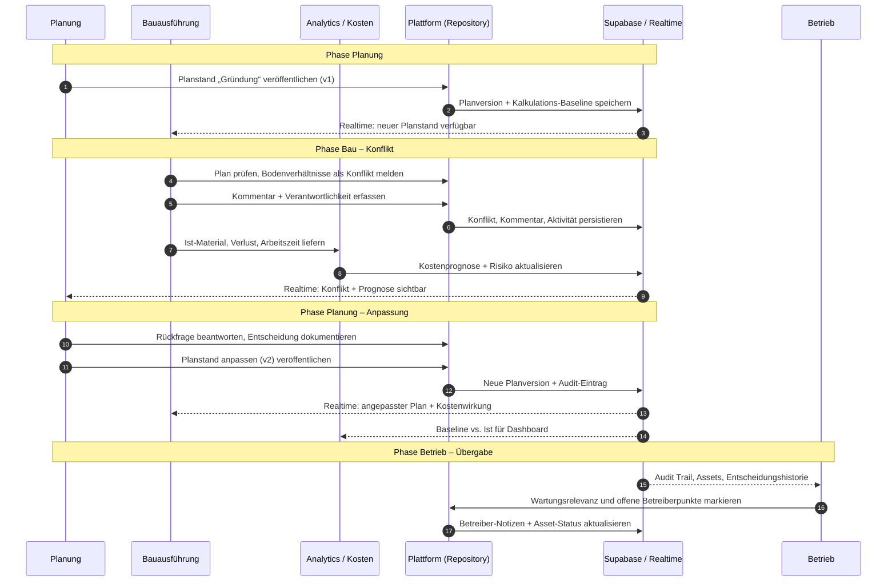

# Demo-Story: Planung → Bau → Betrieb

Diese Seite bildet den Demo-Flow aus [#1](https://github.com/Beierthon/wbk2026/issues/1) (Pitch) und [#2](https://github.com/Beierthon/wbk2026/issues/2) (Epic) als **Sequenzdiagramm** ab. Der Beispielkonflikt: Die initiale Gründungsplanung berücksichtigt die Bodenverhältnisse nicht — das Bau-Team meldet das zurück, die Planung passt an, der Betreiber sieht später die vollständige Entscheidungshistorie.

## Beispielkonflikt (Kurzfassung)

1. Planer veröffentlicht die initiale Gründungsplanung.
2. Das Bau-Team stellt abweichende Bodenverhältnisse fest und meldet einen Konflikt.
3. Kommentar, Risikobewertung und Kostenprognose entstehen.
4. Die Planung passt den Planstand an und veröffentlicht eine neue Version.
5. Kosten- und Zeitplanwirkung werden im Analytics-Cockpit sichtbar.
6. Der Betreiber übernimmt Historie, Assets und Wartungsfolgen.

Der Ablauf ist in der App als geführte Tour unter `/demo` erlebbar (siehe [#44](https://github.com/Beierthon/wbk2026/issues/44)).

## Sequenzdiagramm

## Ergänzende Flows

Weitere Mermaid-Diagramme (Gesamtarchitektur, Vision, API Wrapper):

→ **[architecture.md](../architecture.md)** — Abschnitt „Domain Workflow“

Showcase-Dokumentation für einzelne Demo-Schritte:

| Schritt | Issue |
| --- | --- |
| Geführte Plattformtour | [#44](https://github.com/Beierthon/wbk2026/issues/44) |
| Baukonflikt Planung → Betreiber | [#45](https://github.com/Beierthon/wbk2026/issues/45) |
| Materialanalyse & Kosten | [#46](https://github.com/Beierthon/wbk2026/issues/46) |
| Kamera & Plan-/CAD-Abgleich | [#47](https://github.com/Beierthon/wbk2026/issues/47) |
| Betreiberübergabe & Wartung | [#48](https://github.com/Beierthon/wbk2026/issues/48) |

## Verwandte Dokumente

- [pitch.md](./pitch.md) — vollständiger Pitch-Text
- [demo-data.md](../demo-data.md) — Demo-Projekt „Campus West“
- [Docs-Hub](../README.md)
